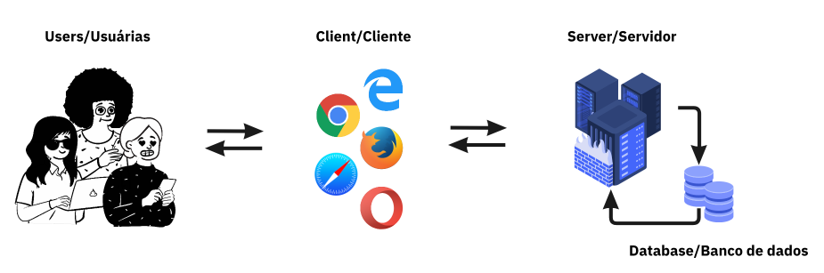
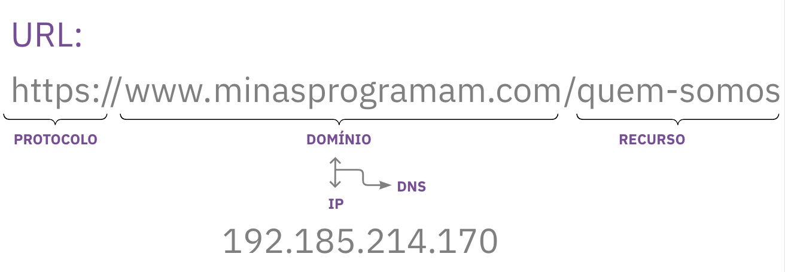
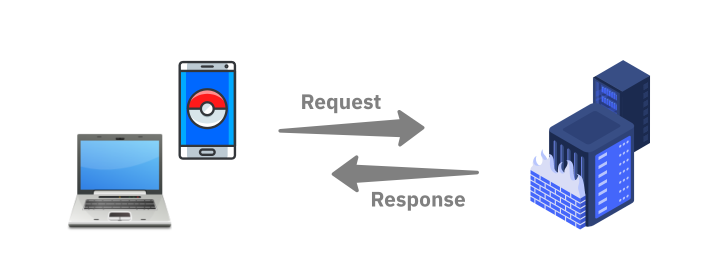

# Consumindo API's com JavaScript - Teórica, Prática I & Prática II

minasProgramam - Curso de introdução a programação - 12ª semana (07, 08 e 10/11/2022)

## Roteiro

- [Promise](#1-promises)
- [async/await](#2-asyncawait)
- [try/catch](#3-trycatch)
- [Requisição a APIs](#4-requisição-a-apis)
    - [Server/Client](#41-serverclient)
    - [URL, Domínio, IP e DNS](#42-url-domínio-ip-e-dns)
    - [Protocolo HTTP](#43-protocolo-http)
    - [Request/Response](#44-requestresponse)
    - [API](#45-apis)
    - [JSON](#46-json)
    - [fetch()](#47-fetch)

## A Professora - Lilit 


- Me chamo [Lilit Bandeira](https://www.instagram.com/lilitravesti), sou uma travesti paraibana residente em São Paulo, trabalho como Software Engineer no Nubank e professora no {reprograma} e minasProgramam;

- [LinkedIn](https://www.linkedin.com/in/lilitbandeira)
- [GitHub](https://github.com/lilitbandeira)
- [E-mail](devlilitbandeira@gmail.com)

## A Monitora - Lorena


- Sou Lorena, ex-aluna e professora na {reprograma} e monitora aqui no minasProgramam, engenheira de software no Zé Delivery, nômade digital (atualmente em São Paulo) :)

- [LinkedIn](https://www.linkedin.com/in/lorena-rabelo)
- [GitHub](https://github.com/lorena-rabelo)
- [E-mail](ola.lorenarabelo@gmail.com)

---
## Acordos

- Enviar dúvidas no chat para a monitora;
- Levantar a mão sempre que desejar falar, o que pode ser feito a qualquer momento;
- Manter microfones desligados sempre que alguém estiver falando;
- Manter as câmeras ligadas o máximo de tempo possível;
- Forquem o repositório, clonem seus forkes e criem uma branch com seus nomes, na resposta do desafio, mude o nome da pasta `nome-aluna` para o seu. ex.: `lilit-bandeira` ;

## Instruções iniciais 

- Instalar [node.js](https://nodejs.org/en/download/)
- Instalar [Postman](https://www.postman.com/downloads/)


# Plano de Aula

## 1. Promises

- Promise é um objeto do JavaScript que nos permite lidar com assincronicidade através de estados;
- Funções assíncronas modernas retornam uma promise que representa a eventual falha ou conclusão de uma operação assíncrona, assim uma função assíncrona retorna um valor como uma função síncrona, porém no lugar do valor final, retorna uma promessa ao valor em algum momento no futuro;
- Ciclo de vida da Promisse (estados):

  | Estado     | Significado                                                                                  |
  | ---------- | -------------------------------------------------------------------------------------------- |
  | Pending    | Estado inicial, quando a promise ainda está em execução (não resolveu ou rejeitou)           |
  | Fulfilled  | Quando executou todas as operações com sucesso                                               |
  | Rejected   | Quando a execução finalizou com erro, falhou                                                 |

<br>

<br><br>

- Cria-se uma promise a partir da função construtora Promise passando como argumento uma callback que por sua vez recebe como argumentos os dois resultados possíveis para a promise: resolve ou reject, duas outras funções que executam o possível sucesso ou erro da promessa, respectivamente;
- `resolve()`: Função que executa caso a promise seja resolvida com sucesso;
- `reject()`: Função que executa caso a promise seja resolvida com erro;
- Tratamos o retorno das promises através de métodos próprios, que chamam as callbacks depois da conclusão da promise;
- `then()`: Método que ativa uma callback quando a promise for resolvida, o argumento desta callback é sempre o valor retornado na função resolve();


  
> O then() retorna uma nova promise e por isso vários thens podem ser encadeados para casos onde existam duas ou mais operações assíncronas consecutivas, neste caso o valor do primeiro argumento de cada then encadeado será o valor do retorno do anterior; 

- `catch()`: Método que ativa uma callback quando a promise for rejeitada, o argumento desta callback é sempre o valor retornado na reject();


---
## 2. async/await

- As palavra-chaves async e await atuam como um 'açúcar sintático' em cima de promises, faciltando a visualização e tornando a leitura do código assíncrono mais próxima do código síncrono;
- Toda função que recebe o `async` se torna uma função assíncrona, que passa a retornar uma promise ao invés de retornar um valor diretamente, como uma promise o retorno desta função pode ser tratado com um then() normalmente;
- Uma função `async` permite que a palavra-chave `await` seja usada dentro dela para invocar código assíncrono;
-  o `await` só funciona dentro de funções `async` e é colocado na frente de qualquer função que retorne promise para pausar o código até que a promise seja resolvida, retornando o valor resultante, importante usar apenas quando necessário tratar respostas de uma promise para não paralizar o fluxo, quando usado da maneira correta não altera a performance da aplicação;
- Não precisa de funções para sincronizar os resultados;
- Outro método importante da promise é o `Promisse.all()` que recebe uma array de funções assincronas independentes entre si, evitando o uso de awaits que não sejam necessários;
- Facilita o tratamento de erros seja com menor encadeamento do .then() ou ainda com o uso de `try/catch`;


<br>

---
## 3. try/catch

- É usado para marcar um bloco que será testado (`try`) e especifica uma ação para que uma possível exceção(erro) seja capturada pelo `catch()`;
- Ao usar o `try` é criado um bloco de código protegido, que caso ocorra algum erro neste bloco, a execução é desviada para o `catch()`, desta forma a aplicação não será quebrada e o erro poderá ser tratado, permitindo que o código siga sua execução;
- O `catch()` é executado somente quando há alguma exceção no bloco `try`, caso contrário ele será ignorado, o argumento recebido pelo catch é a exceção ocorrida no bloco `try` e costuma ser chamada de `err`/`error`;

---
## 4. Requisição a APIs

### 4.1. Server/Client



- <b style="color: greenyellow;">Client</b> é a interface que as usuárias interagem, isso inclui os navegadores e os apps e demais interfaces utilizadas pela usuária e que acessa a internet em diversas plataformas. O Client é responsável por solicitar serviços e dados que estão nos Servers;

- É no Client que podemos:
  1. Capturar e Validar dados inseridos pelas usuárias;
  2. Manipular a tela de acordo com as informações vindas do servidor;
  3. Gerenciar os eventos disparados pelas usuárias;
  4. Gerenciar as mídias dos dispositivos das usuárias (som e vídeo);

<br>

- <b style="color: greenyellow;">Server</b> é o responsável pelo processamento, a organização e o gerenciamento dos dados. Um Server responde às solicitações de serviços e dados realizadas pelos Clients;

- É no Server que podemos:
  1. Autenticar usuárias nas aplicações;
  2. Organizar e atualizar os dados compartilhados;
  3. Gerenciar recursos compartilhados;
  4. Fazer a comunicação com os bancos de dados;

---
### 4.2. URL, Domínio, IP e DNS

- A <b style="color: greenyellow;">URL</b> - Uniforme Recourse Locator (Localizdor de recurso uniforme), representa um recurso específico na web, cada página, imagem ou qualquer arquivo na internet possui um endereço, a URL.


image.png

- Todo site possui um <b style="color: greenyellow;">domínio</b>, que é como o conhecemos e acessamos normalmente;
- Para o servidor este mesmo site é registrado, identificado e localizado pelo seu <b style="color: greenyellow;">IP</b> - Internet Protocol Address (Endereço de protocolo da Internet); 
- É por isso que existe o <b style="color: greenyellow;">DNS</b> - Domain Name System (Sistema de Nome de Domínio), que é como um grande dicionário de `domínios <-> IPs` nativo nos browsers e demais Clients;

---
### 4.3. Protocolo HTTP

- O <b style="color: greenyellow;">HTTP</b> - Hypertext Transfer Protocol (Protocolo de transferência de Hipertexto) é um protocolo de comunicação. Através dele o cliente e o servidor conseguem se comunicar, seguindo um conjunto de regras bem definidas. Esse protocolo determina como devem ser solicitadas informações e como elas devem ser entregues.

- Quando acessamos uma <b style="color: greenyellow;">URL</b>, o <b style="color: greenyellow;">Client</b> envia uma solicitação passando todas as informações que precisamos para o <b style="color: greenyellow;">Server</b>, esta comunicação é feita na grande maioria dos casos de aplicações modernas através do <b style="color: greenyellow;">Protocolo HTTP</b>

---
### 4.4. Request/Response



- O protocolo HTTP é um protocolo usado no modelo Client/Server e é baseado em <b style="color: greenyellow;">requests</b>(requisições) e 
<b style="color: greenyellow;">responses</b>(respostas);

- Uma <b style="color: greenyellow;">Request</b> deve indicar a ação a ser executada de acordo com as definições do protocolo HTTP, estes são os <b style="color: greenyellow;">Métodos HTTP</b>

- Principais métodos HTTP:

| Estado   | Ação realizada                                                                                             |
| -------- | -------------------------------------------------------------------------------------------------------    |
| POST     | <b style="color: greenyellow;">C</b>reate (Criar) - Armazena dados no banco                                |
| GET      | <b style="color: greenyellow;">R</b>ead (Ler) - Realiza apenas leitura de dados no banco                   |
| PUT      | <b style="color: greenyellow;">U</b>pdate (Substituir) - Atualiza dados substituindo o conjunto de dados   |
| PATCH    | <b style="color: greenyellow;">U</b>pdate (Modificar) - Atualiza dados modificando apenas o campo desejado |
| DELETE   | <b style="color: greenyellow;">D</b>elete (Excluir) - Exclui dados do banco                                |

- Uma <b style="color: greenyellow;">Response</b> é a <i style="color: pink;">reação</i> do <b style="color: greenyellow;">Server</b> enviada após receber uma requisição do <b style="color: greenyellow;">Client</b>, e seu conteúdo possui além do que foi solicitado, um <b style="color: greenyellow;">Status Code</b>.

| Código    | Tipo de Resposta       |
| --------- | ---------------------  |
| 100 - 199 | Apenas informações     |
| 200 - 299 | Sucesso                |
| 300 - 399 | Redirecionamento       |
| 400 - 499 | Erro do Client         |
| 500 - 599 | Erro do Server         |

---
### 4.5. APIs

- Uma <b style="color: greenyellow;">API</b> - Application Programming Interface (Interface de Programação de Aplicativos) é uma interface de comunicação e integração entre aplicações. As <b style="color: greenyellow;">APIs</b> criam formas e ferramentas para que utilizemos uma funcionalidade ou acessemos dados sem precisar recriar coisas que já existem.

- As <b style="color: greenyellow;">APIs</b> podem ser uma Web APIs, uma lib, um framework e todas as interfaces que forneçam funcionalidades em uma linguagem específica;

- As <b style="color: greenyellow;">Web APIs</b> são um conjunto de instruções e padrões de programação para acesso a um aplicativo de software fornecido por uma empresa de software para que outras desenvolvedoras possam utiliza-o em sua próprias aplicações, algumas destas são <b style="color: greenyellow;">APIs públicas</b> que podem ser acessadas por meio de cadastros gratuitos ou até completamente aberta, outras são <b style="color: greenyellow;">APIs privadas</b> que são de uso restrito/interno da empresa criadora.

- Dentre as arquiteturas das APIs, temos as <b style="color: greenyellow;">APIs REST</b>: A arquitetura REST - ou Representational State Transfer (Transferência de Estado Representacional), que é amplamente utilizada dentro do desenvolvimento de APIs pois possui um modelo mais simples de requisição que segue determinadas práticas e diretrizes na sua criação, neste curso iremos estudar as <b style="color: greenyellow;">APIs REST</b>.

- Exemplos de APIs públicas:
  1. [Dog API](https://dog.ceo/dog-api/)
  2. [ViaCEP API](https://viacep.com.br/)
  3. [ReqRes API](https://reqres.in/)
  4. [Studios Ghibli API](https://ghibliapi.herokuapp.com/)
  5. [Yu-gi-oh! API](https://db.ygoprodeck.com/api-guide/)
 
 <br>

- Toda API possui uma documentação que nos fornece tudo que precisamos saber para utilizá-la;

---
### 4.6. JSON

- <b style="color: greenyellow;">JSON</b> - JavaScript Object Notation (Notação de Objeto JavaScript) é um formato baseado em texto padrão para representar dados estruturados com base na sintaxe do objeto JavaScript; _(MDN)_

- Mesmo que se assemelhe à sintaxe literal do objeto JavaScript, ele pode ser usado independentemente do JavaScript, e muitos ambientes de programação possuem a capacidade de ler (analisar) e gerar JSON; _(MDN)_

- O <b style="color: greenyellow;">JSON</b> é transmitido por uma rede como string e é uma formatação muito leve, o que permite ser utilizado em uma variedade enorme de aplicações. 

- O JavaScript possui o Objeto global `JSON` que possui métodos para converter para objeto quando queremos acessar os dados e para string quando queremos enviá-lo por rede;

```js

JSON.parse() // analisa uma string JSON, construindo um objeto iteravel JavaScript descrito pela string.
JSON.stringify() // converte um objeto iteravel javascript para uma String JSON. 

```

- Um Json pode ser armazenado em seu próprio arquivo. _(MDN)_ (**ex.: arquivo.json**)

### Estrutura JSON

```json
{
  "squadName": "Super hero squad",
  "homeTown": "Metro City",
  "formed": 2016,
  "secretBase": "Super tower",
  "active": true,
  "members": [
    {
      "name": "Molecule Man",
      "age": 29,
      "secretIdentity": "Dan Jukes",
      "powers": ["Radiation resistance", "Turning tiny", "Radiation blast"]
    },
    {
      "name": "Madame Uppercut",
      "age": 39,
      "secretIdentity": "Jane Wilson",
      "powers": [
        "Million tonne punch",
        "Damage resistance",
        "Superhuman reflexes"
      ]
    },
    {
      "name": "Eternal Flame",
      "age": 1000000,
      "secretIdentity": "Unknown",
      "powers": [
        "Immortality",
        "Heat Immunity",
        "Inferno",
        "Teleportation",
        "Interdimensional travel"
      ]
    }
  ]
}
```

_(fonte: MDN)_

### Acessando JSON

```js
console.log(superHeroes.homeTown);
console.log(superHeroes["active"]);
console.log(superHeroes["members"][1]["powers"][2]);
```

### Matrizes como JSON

```json
[
  {
    "name": "Molecule Man",
    "age": 29,
    "secretIdentity": "Dan Jukes",
    "powers": ["Radiation resistance", "Turning tiny", "Radiation blast"]
  },
  {
    "name": "Madame Uppercut",
    "age": 39,
    "secretIdentity": "Jane Wilson",
    "powers": [
      "Million tonne punch",
      "Damage resistance",
      "Superhuman reflexes"
    ]
  }
]
```

### Acessando JSON (matrizes)

```js
console.log(heroes[0]["powers"][0]);
```

### Importante:

> JSON contém apenas propriedades, sem métodos; 

> JSON só aceita aspas duplas; 

> JSON não aceita chaves/propriedades sem aspas como objetos JS, toda string precisa usar aspas;

---
### 4.7. fetch()

- `fetch()` é um método moderno e amplamente utilizado nas aplicações JavaScript atualmente que permite acesso e manipulação de requisições HTTP, este método é fornecido pela <b style="color: greenyellow;">API Fetch</b>. O `fetch()`retorna uma `Promise`.

- Estrutura do `fetch()`:

```js
  fetch(url, options)
```

- `url` é geralmente uma string que se refere ao recurso que desejamos buscar, no caso do método `GET` somente este argumento é necessário;
- `options` é um argumento opcional, um objeto que contém qualquer configurações customizadas que desejamos adicionar às requisições, sendo os principais: 
  1. `method` uma string que define o método da requisição;
  2. `headers` um objeto com informações de cabeçalho;
  3. `body` um objeto com informações do corpo da requisição;

<br>

- Uma requisição `GET` utilizando `fetch()`, sem informações adicionais:

```js
async function getData() {
  try {
    const response = await fetch("https://api.exemplo.com")
    const data = await response.json()
    console.log(data)
  }
  catch(erro) {
    console.log("HTTP-Error: " + erro);
  }
}
getData()
```

- Uma requisição `GET` utilizando `fetch()`, adicionando um objeto de configurações:

```js
async function getData() {
  try {
    const response = await fetch("https://api.exemplo.com", {
      method: 'GET', //opcional
      headers: {
      'Content-Type': 'image/jpeg',
      'Authorization': '7746y27361749f029-1'
      }
    })
    const data = await response.json()
    console.log(data)
  }
  catch(erro) {
    console.log("HTTP-Error: " + erro);
  }
}
getData()
```


# Exercícios de Fixação:

## Exercício dos Doguinhos para praticar `GET` 

- Vamos realizar uma requisição à [Dog API](https://dog.ceo/dog-api/) utilizando `fetch()` para trazer imagens de doguinhos de acordo com suas raças através do <b style="color: greenyellow;">endpoint</b>: https://dog.ceo/api/breed/${dogName}/images/random e exibir a imagem na tela a cada atualização da página;

## Exercício das cartas yu-gi-oh para praticar `GET` 

- Vamos realizar uma requisição à [Yu-gi-oh! API](https://db.ygoprodeck.com/api-guide/) utilizando `fetch()` para trazer a lista de cartas do jogo/mangá através do <b style="color: greenyellow;">endpoint</b>: https://db.ygoprodeck.com/api/v7/cardinfo.php e exibir 5 cartas de nossa preferência na nossa página;

## Exercício da hackear() API para praticar `GET, PUT, PATCH e DELETE` 

- Vamos utilizar todo conhecimento adquirido até aqui para praticar todos os principais métodos HTTP em requisições feitas à [hackear() API](https://teste-api-lilit.herokuapp.com/api-docs/), uma API privada que teremos acesso na aula;


# Desafio Ghibli

- Utilize o `fetch()` para realizar uma requisição ao endpoint https://ghibliapi.herokuapp.com/films da [Studios Ghibli API](https://ghibliapi.herokuapp.com/) e popule a página que também será criados por vocês (HTML e CSS) com os dados do json que é a lista com os 22 filmes da Ghibli, você pode utilizar apenas parte dos filmes, para isso sugiro utilizar o método `.slice()`;

# Referências

- [Curso Glaucia](https://www.youtube.com/watch?v=SXBNpzjusgY&list=PLb2HQ45KP0WsFop0pItGSUYl6baYjKEye&ab_channel=GlauciaLemos)
- [Curso Willian Justen](https://www.youtube.com/watch?v=RtfBx90R070&list=PLlAbYrWSYTiPQ1BE8klOtheBC0mtL3hEi&ab_channel=WillianJusten)
